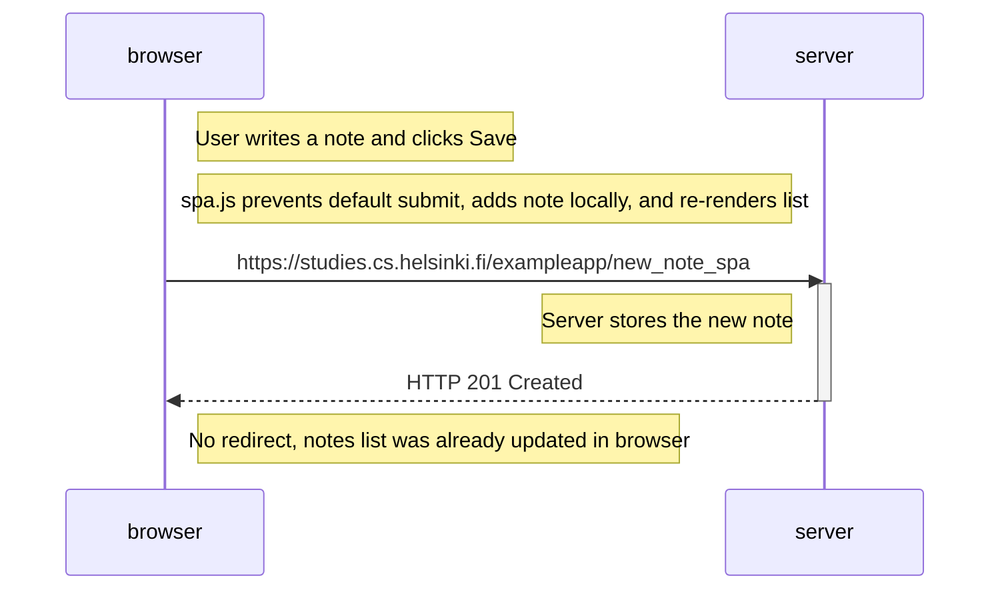

```mermaid
sequenceDiagram
    participant browser
    participant server

    Note right of browser: User writes a note and clicks Save

    Note right of browser: spa.js prevents default submit, adds note locally, and re-renders list

    browser->>server: https://studies.cs.helsinki.fi/exampleapp/new_note_spa
    activate server
    Note left of server: Server stores the new note
    server-->>browser: HTTP 201 Created
    deactivate server

    Note right of browser: No redirect, notes list was already updated in browser
```
